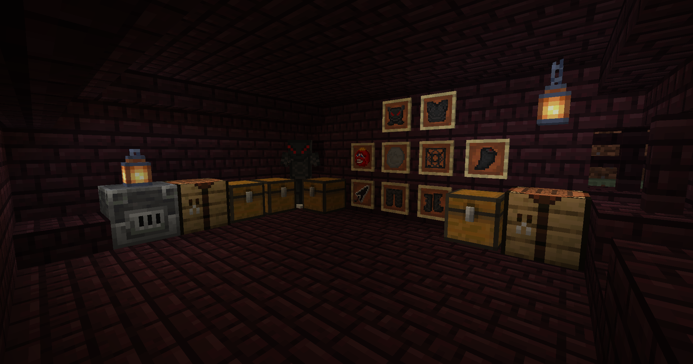

# BerserkMod
*A Minecraft mod for those who carry a sword too heavy to be called one*

This is a Minecraft Forge mod themed around Berserk, built for Hackclub Macondo YSWS.

I had never written a line of Java before this, every system below, from the custom armor material, to the death
cancelling eclipse event, was built, understood, PIECE BY PIECE. made with luv <3 in memory for Kentaro Miura

## Live Demo

- [Berserk Mod Demo](https://youtu.be/0JyDN5xPMUY) - Full mod overview Demo

## Play it your own!
Grab the `.jar` from [Releases](#) and drop it in your `mods` folder.
REQUIRES FORGE FOR MINECRAFT 1.15.2.

## Setup

- Clone the repo, open in IntelliJ IDEA, let Gradle sync
- Run `genIntelliJRuns`, then `runClient` from the Gradle panel
- Or grab the build `.jar` and install it like any forge mod

## Tech Stack!!

- JAVA 8
- Minecraft Forge (1.15.2 - MDK)
- Gradle
- GUIDE USED Make a Minecraft Mod, Get Free Minecraft By @KaiDevrim

## Features

**Dragon Slayer** - A sword Forged from raw Iron, too big to be called a sword 11 damage, slow heavy swings.
Punishes you with Slowness + Weakness if you land a hit without wearing the full Berserker Armor Set

**Berserker Armor** - A 4 piece set forged from beast fangs, a rare drop from wither Skeletons, Custom armor material

**Crimson Behelit** - Carry it, and death changes, Your Death is cancelled, the Withers's death cry echoes, the screenfloods red, and you are branded with
the sacrifice brand forever, A hord of Zombies, armed Skeletons, Spiders, and axe-wielding Vindicators spawn around you as the Eclipse Begins....

**Sacrifice Brand** - A custom permanent curse. you can no longer Sleep, and Apostles hunt you at night

**Protection Talisman** - A drinkable cure for the Brand, if you can craft it...

## What I have learned

oh gosh
- Java FROM ABSOLUTE ZERO, classes, inheritance, constructors, parameters and more much more....
- Forge's Registration pattern (`DefferredRegister`, `RegistryObject`, Lambdas)
- Event-driven programming, listening for, and cancelling game events yeii
- Debuggin real stack traces instead of guessing
- Custom `IArmorMaterial` and `Effect` subclasses
- That a single `_` misplaced in a JSON file, CAN TAKE DOWN AN ENTIRE RECIPE!!!!

## Screenshots

## Special thanks

Hackclub Macondo YSWS orgs and support team, this is my final project for macondo, for the tutorial that got this started, and for making my first java project feel possible.

## You might also like
- [The Branded One](https://github.com/Cocotrilito/The-Branded-one) - An NFC business card
- [The Despach of Cocotrilo](https://github.com/Cocotrilito/the-despacho-of-cocotrilito/tree/main) - My personal Website brand NEW!!

